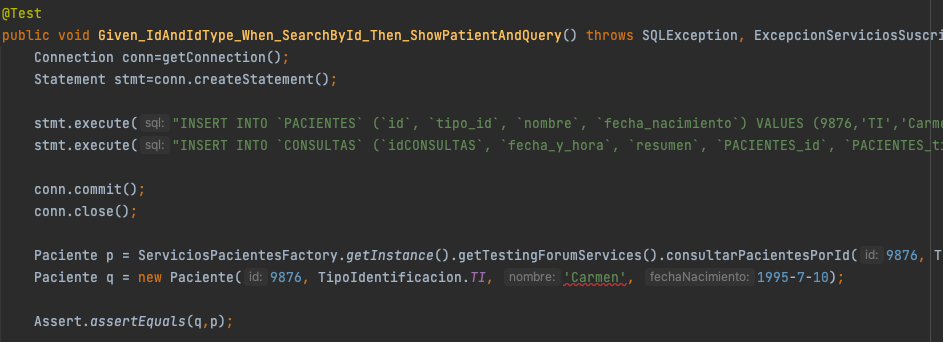

## Escuela Colombiana de Ingeniería

### PDSW – Procesos de desarrollo de Software
### Parcial Segundo Tercio

1. A partir de la especificación hecha en los métodos consultarPacientesPorId y consultarMenoresConEnfermedadContagiosa de la fachada de 
servicios (la parte lógica de la aplicación), implemente sólo una prueba (la que considere más importante para validar las especificaciones 
y los criterios de aceptación). Siga el esquema usado en ServicesJUnitTest para poblar la base de datos volátil y verificar el comportamiento 
de las operaciones de la lógica.
