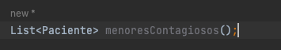

## Escuela Colombiana de Ingeniería

### PDSW – Procesos de desarrollo de Software
### Parcial Segundo Tercio

1. A partir de la especificación hecha en los métodos consultarPacientesPorId y consultarMenoresConEnfermedadContagiosa de la fachada de 
servicios (la parte lógica de la aplicación), implemente solo una prueba (la que considere más importante para validar las especificaciones 
y los criterios de aceptación). Siga el esquema usado en ServicesJUnitTest para poblar la base de datos volátil y verificar el comportamiento 
de las operaciones de la lógica.

* Primero, crearemos un repositorio en donde clonaremos el repositorio original para poder trabajarlo.

* Luego, crearemos los test correspondientes para probar la funcionalidad de la base de datos local, siguiendo el esquema de conexion de la primera prueba.
En esta prueba verificamos que la consulta realizada a la base de datos corresponda con el paciente correcto creado anteriormente, comparando el id dado con el
id del paciente resultado de la consulta.

2. Implemente la historia de usuario #1, agregando todo lo que haga falta en la capa de presentación, lógica y de persistencia. La vista debe implementarse en consultaPaciente.xhtml.

La historia de usuario #1 nos dice que:

>**Como** Usuario de la plataforma de consultas médicas
>
>**Quiero** Poder consultar un paciente a partir de su número y tipo de identificación.
>
>**Para Poder** hacer una revisión de las consultas realizadas por un paciente cuyo documento ya conozco, y así evitar la búsqueda por el nombre del paciente.
>
>**Criterio de aceptación:** Se debe mostrar la fecha de nacimiento del paciente, su nombre, y cada una de las consultas realizadas. Las consultas deben estar organizadas de la más reciente (mostrados arriba) a la más antígua, y deben mostrar la fecha y el resúmen.

Para cumplir con lo anterior, debemos hacer que se muestre el resultado de la consulta SQL, haciendo que coincida la busqueda con el id y tipo ingresado.
* Para esto primero iremos al archivo de _PacienteMapper.xml_, donde pondremos la consulta que necesitamos para la historia de usuario:

* También es importante en este mismo archivo agregar el _resultMap_ de esta consulta, pues nos servira para llenar los parametros de la clase Paciente que tiene como resultado esta consulta.

* Por ultimo, agregaremos el _resultMap_ de la consulta que nos ayudara a llenarlos parametros de la clase consulta.

* Ahora, agregaremos a la clase de _PacienteMapper_ el detalle del metodo getPacientesPorId, que buscara la consulta en el resultMap de Paciente. Es importante que pongamos como parametros los mismos nombres que dejamos en la consulta:

* Pasamos al uso de este metodo en la clase de _MyBatisDAOPaciente_ y agregamos el detalle del metodo load, que cargara al paciente:

* Buscamos en donde se usa este metodo y este está en la clase de _ServiciosPacienteImpl_ y agregamos los parametros necesarios:

* El metodo anterior es usado en el _PacientesBean_ que mostrara los resultados, por lo que agregamos el cuerpo del metodo getPacientesPorId, que usa ServiciosPacienteFactory:

* Ahora configuraremos el archivo _consultaPaciente.xhtml_ para que el boton de Consulta actualice los resultados con la informacion requerida por la historia de usuario:

* Al ejecutar el servicio de Tomcat, podemos ver que consultando un id existente, nos muestra los datos requeridos en la tabla:

3. Implemente la historia de usuario #2, agregando todo lo que haga falta en la capa de presentación, lógica y de persistencia. La vista debe implementarse en consultarMenoresEnfermedadContagiosa.xhtml.

La historia de usuario #2 nos dice que:

>**Como** Usuario de la secretaría de salud de la plataforma
>
>**Quiero** Tener un reporte de las consultas de los menores de edad (menóres de 18 años) en las que en el resúmen se encuentren enfermedades contagiosas.
>
>**Para Conocer** con rapidez qué pacientes debo revisar y tomar medidas al respecto.
>
>**Criterio de aceptación:** El reporte NO debe requerir entrar parámetro alguno. Se considerán como enfermedades contagiosas: 'hepatitis' y 'varicela'. El reporte sólo debe contener el número y tipo de identificación del paciente y la fecha de nacimiento, ordenados por edad de mayor a menor.

* Para cumplir con lo anterior, debemos agregar la consulta SQL requerida en el archivo de _PacienteMapper.xml_:

* Luego en la clase de _PacienteMapper_ agregamos el metodo que creamos con el select de la consulta:

* Asi como en la historia de usuario 1, iremos a la clase de _DAOPaciente_ y agregaremos el metodo de _loadMenoresContagiosos_ y su implementacion en _MyBatisDAOPaciente_:

* Ahora en la clase de _ServiciosPacienteImpl_ en el metodo que ya se encuentra creado _consultarMenoresConEnfermedadContagiosa_ agregaremos el cuerpo que consulta a daoPaciente:

* Ahora crearemos un metodo en _PacientesBean_ llamado _consultarMenoresConEnfermedadContagiosa_ usando el inyector de dependencias de _ServiciosPacientesFactory_:

* El archivo de consultarMenoresEnfermedadContagiosa.xhtml usara este metodo para mostrar los resultados de la busqueda, asi que lo incorporamos al archivo:

